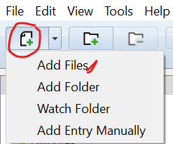
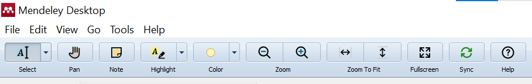
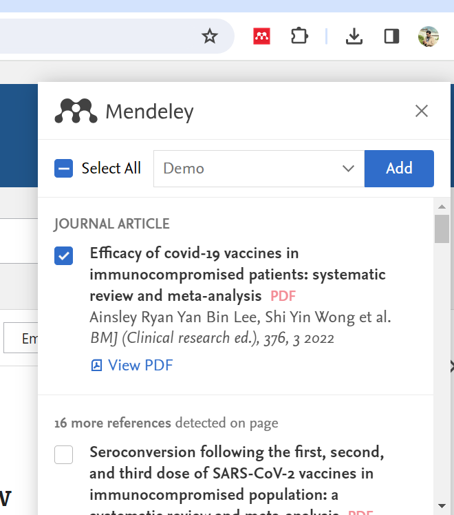

# Adding References to Mendeley Library {-}

## Activity 1: Adding a PDF {-}

- **Import PDF**: Add the PDF shared via email to the Mendeley library by dragging and dropping the file directly into Mendeley or using the “Add file” button.    

{width=30%}             

- **Metadata Extraction**: If the PDF includes embedded metadata, Mendeley will automatically extract this information. If not, manually enter the required details in the desktop app under the 'Details' section.

- **Annotation**: Double-click the PDF to open it in Mendeley. Use the annotation tools to add notes directly on the PDF. Remember to save your annotations before closing the document.

{width=100%}   

## Activity 2: Adding References from PubMed {-}

- **Search for References**: Visit [PubMed](https://pubmed.ncbi.nlm.nih.gov/) and enter the search terms `<covid-19 and vaccine and three dose>` in the search box. Use the 'meta-analysis' filter.

- **Add References**: Click on the first reference to open its details. Use the Mendeley bookmarklet or extension to capture the reference. Select the appropriate destination folder in Mendeley.

{width=35%}

## Activity 3: Adding Multiple References from PubMed {-}

- **Bulk Import**: Return to the PubMed results page and activate the Mendeley extension. Select multiple references using the dialog provided by Mendeley.

- **Sync with Desktop**: Ensure you synchronize your desktop application to update the library with the new references.    

