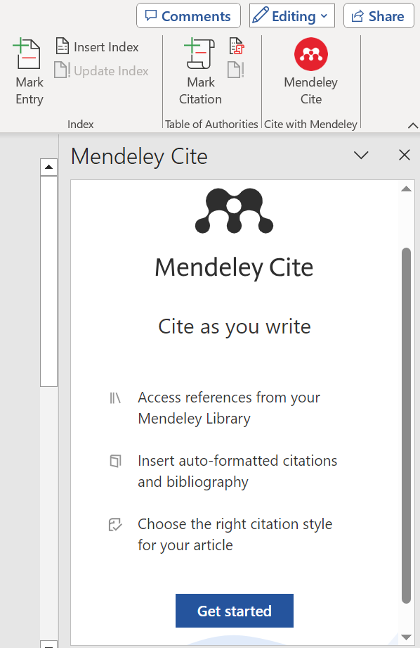

# In-Text Citation and adding bibliography in a Word Document {-}

## In-Text Citation {-}
## Prepare Mendeley {-}

- **Sync Mendeley**: Open the Mendeley Desktop app and click the sync button to ensure all your references are up to date.

## Setting Up in Word {-}

- **Access Mendeley Cite in Word**: Open a Microsoft Word document. Navigate to 'References' > 'Mendeley Cite' > 'Get Started' > Sign in.

- **Understand Mendeley Word Plugin Options**:
  - **References**: Displays a list of citations from the selected folder.
  - **Citation Settings**: Allows you to select your preferred citation style and language.
  - **More Options** (three horizontally placed dots): Provides additional options such as including a bibliography and merging citations.

{width=35%}    
{width=50%}      

## Inserting Citations {-}

- **Choose Citation Style**: Select 'Vancouver superscript' as the preferred style.
  
- **Example Tasks for Citation**:
  - **Simple Citation**: Type a random sentence and use Mendeley Cite to insert a citation. Note the insertion of the citation number in the form of a textbox.
  - **Multiple Citations**: Type another sentence and insert two to three different references at the end.
  - **Combine References**: Create a new sentence and combine references from previous tasks at the end.

## Adding a Bibliography {-}

- **Insert Bibliography**: At the end of your document, type 'References' and use the Mendeley Cite dialog box to select 'Insert Bibliography'. Your references will be formatted in the Vancouver style.

- **Editing and Auto-Correct**: Rearrange cited sentences within your document to observe the auto-correct feature of citation numbers in action.

