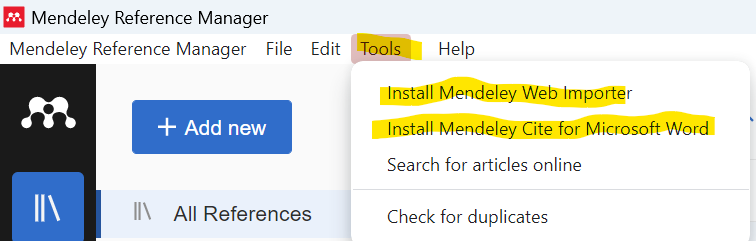
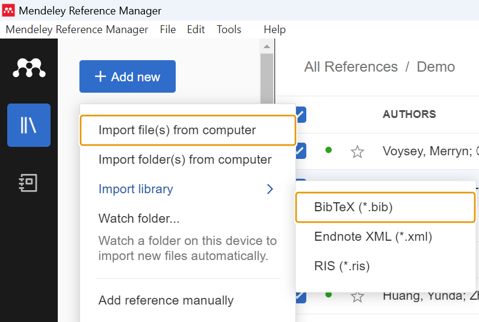

# Work as a Team {-}

## Creating a Group in Mendeley {-}

Mendeley also offers functionality to work collaboratively in groups. Here’s how you can create and manage a group in Mendeley Desktop.

- **Start a New Group**: Click the 'Create Group' button below the menu bar in Mendeley Desktop.

```{r mendeley-create-group, echo=FALSE}
```

# Checking and Merging Duplicates in Mendeley {-}

Most important challenge in any reference manager is duplicate entries in the library which could potentially confuses the user. Mendeley provides a useful feature to identify and merge these duplicates, ensuring your library remains streamlined and accurate. This feature is useful in the initial steps of systematic review.

## Step-by-Step Guide to Managing Duplicates {-}

### Step 1: Access the Duplicate Finder {-}

- **Open Mendeley Desktop**: Start by launching the Mendeley Desktop application.
- **Find Duplicates**: Go to the `Tools` menu and select `Check for Duplicates`. This action prompts Mendeley to scan your library for any entries that appear to be duplicates.
{width=100%}    

### Step 2: Reviewing Duplicates {-}

- **Review List**: Mendeley will display a list of potential duplicates. It's important to review each set carefully to confirm whether they are indeed duplicates. Mendeley typically groups similar items based on title, authors, and publication year.

### Step 3: Merge Duplicates {-}

- **Select References**: For each group of duplicates, you can select the references that you want to merge. Mendeley allows you to compare the details side by side to choose which details to retain.
- **Merge Entries**: After selecting the desired references and confirming the details to keep, click the `Merge` button. This will combine the selected entries into a single reference entry in your library.

### Step 4: Confirm Changes {-}

- **Check Library**: Once you merge the duplicates, review your library to ensure that the entries have been correctly merged and that no additional duplicates are present.
- **Continuous Monitoring**: Regularly checking for duplicates is good practice, especially after adding new references to your library.

## Tips for Preventing Duplicates {-}

- **Consistent Importing Practices**: Always import references using consistent formats and from reliable sources to minimize variations that could lead to duplicates.
- **Use DOI for Imports**: When available, use the Digital Object Identifier (DOI) to import articles, as it helps in accurately identifying and retrieving the exact document without duplication.

# Exporting References from Mendeley {-}

Mendeley offers robust export functionalities that allow you to take your library of references and use them across various platforms and formats. Whether you need to share your data with colleagues, submit it as part of a publication, or integrate it into other citation managers, Mendeley makes this process straightforward.

## Step-by-Step Guide to Exporting References {-}

### Step 1: Select Your References {-}

- **Choose References**: Navigate to your library and select the references you wish to export. You can select individual references, entire folders, or your entire library depending on your needs.

### Step 2: Export References {-}

- **Access Export Options**: With your references selected, go to the `File` menu and choose `Export`.
- **Choose Format**: A dialog box will appear where you can select the format for the export. Mendeley supports several formats, including:
  - **BibTeX (.bib)**: Useful for LaTeX users.
  - **RIS (.ris)**: Compatible with many other reference managers like EndNote and Zotero.
  - **EndNote XML (.xml)**: Suitable for users who are migrating to or from EndNote.

{width=80%}

### Step 3: Save the File {-}

- **Specify File Location and Name**: Choose where you want to save the exported file on your computer, and give it a descriptive name.
- **Save**: Click `Save` to complete the export process. Your selected references will now be saved in the chosen format at the specified location.

### Step 4: Verify Export {-}

- **Check Exported File**: Navigate to the file location and open the file to ensure all desired references have been correctly exported and formatted.
- **Use Exported Data**: You can now import this file into other citation management tools, include it in your LaTeX documents, or share it with colleagues as needed.

# Importing References into Mendeley {-}

Receiving reference files in various formats from collaborators is common in academic research. Mendeley supports importing references from multiple formats, allowing users to consolidate their research materials gathered from different sources or citation managers effectively.

## Step-by-Step Guide to Importing References {-}

### Step 1: Prepare Your Files {-}

- **Gather Files**: Before you start, make sure that you have the reference files you intend to import into Mendeley. Commonly supported formats include:
  - **BibTeX (.bib)**
  - **RIS (.ris)**
  - **EndNote XML (.xml)**

### Step 2: Open Mendeley Desktop {-}

- **Launch Mendeley Desktop**: Open Mendeley and ensure you are logged into your account. This prepares the software to receive new bibliographic information.

### Step 3: Import References {-}

- **Access Import Options**: Navigate to `File` in the menu bar and select `Import`. This can also be found under `Add New` > `Import library`.
- **Select File Type**: Choose the format of the file you are importing based on the file's extension:
  - Select `BibTeX (*.bib)` for BibTeX files.
  - Choose `RIS (*.ris)` for RIS files.
  - Opt for `EndNote XML (*.xml)` for EndNote files.    
  
{width=50%}    

- **Choose File**: A file dialog box will appear. Navigate to where the reference file is stored on your computer, select it, and then click `Open`.    

### Step 4: Review and Organize Imported References {-}

- **Review Entries**: Mendeley will display the imported references. It's crucial to review these entries to ensure that all data has been imported correctly and is formatted accurately.
- **Organize Your Library**: Organize the new references by placing them into appropriate folders or groups, tagging them for easier retrieval, or merging any duplicates with existing entries in your library.    

### Step 5: Verify and Sync {-}

- **Sync with Mendeley Web**: To ensure all your devices show the updated library, sync your local Mendeley Desktop library with your Mendeley Web account. This step is vital for maintaining consistency across platforms.

