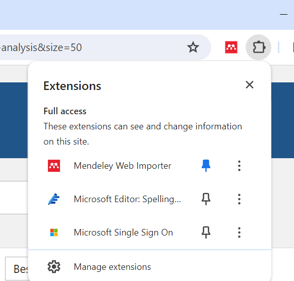
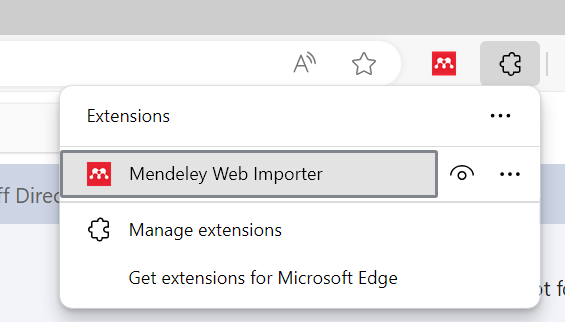
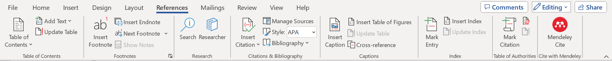
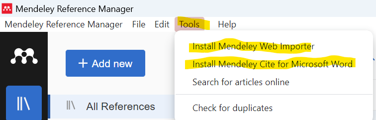

# Troubleshooting Mendeley {-}

## Mendeley Web Importer Doesn't Appear in the Chrome Browser {-}

If the Mendeley Web Importer isn't showing up in your Chrome browser, you might need to enable it manually:

- **Enable Chrome Extensions**: Type `chrome://extensions/` in the address box or navigate to Manage Extensions by clicking the extension icon in the browser. Make sure the Mendeley Web Importer is toggled on.     

{width=50%}     

- **Enable Edge Extensions**: Type `edge://extensions/` into the address bar or navigate to Manage Extensions by clicking on the extensions icon (puzzle piece) in the upper right corner of the Edge browser. Ensure that the Mendeley Web Importer is toggled on.    

{width=50%}   

## Mendeley Plugin Doesn't Appear in MS Word {-}

If you do not see the Mendeley citation plugin in Microsoft Word, follow these steps:

- **Close All Word Documents**: Ensure that all Word documents are closed to prevent any issues during the installation.     
{width=100%}     
- **Open Mendeley Desktop**: Navigate to `Tools` > `Install MS Word Plugin`. This will attempt to install or re-enable the Word plugin.      

{width=100%}     

