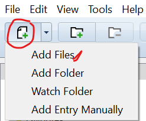
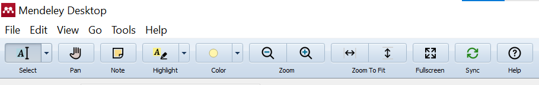
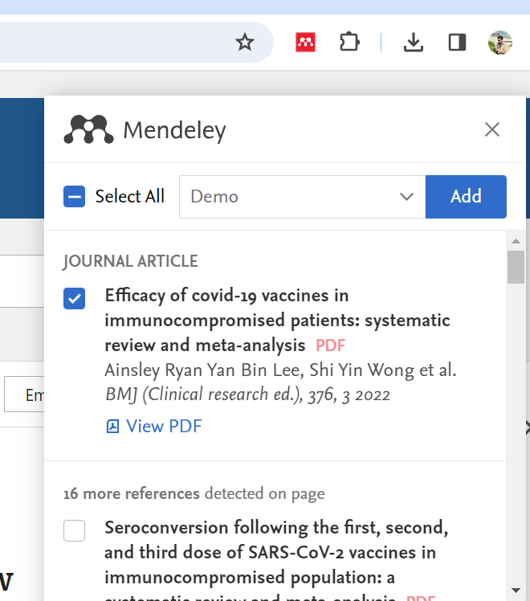
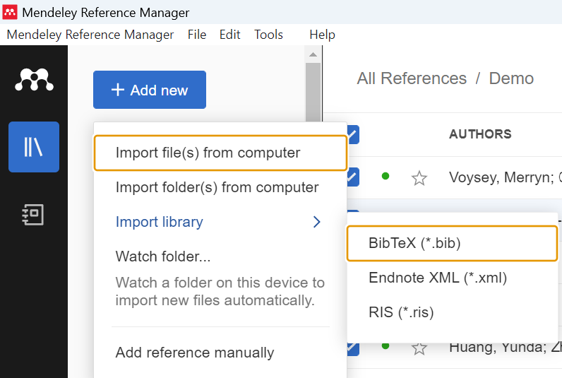

# Cite and Write using Mendeley {-}

## Objectives    {-}

-   **Manage and Cite References Independently:** Learn to handle your reference management autonomously.
-   **Prepare Your Bibliography:** Understand how to compile and format a comprehensive bibliography.
-   **Master Reference Styles and In-text Citations:** Gain knowledge of various referencing styles and learn to apply in-text citations in Microsoft Word.


## Target Audience    {-}

-   **Broad Applicability:** Ideal for any student, scholar, or researcher who writes assignments, articles, or scientific content.     


```{r include=FALSE}
# automatically create a bib database for R packages
knitr::write_bib(c(
  .packages(), 'bookdown', 'knitr', 'rmarkdown', 'xml2', 'downlit'
), 'packages.bib')
options(tinytex.verbose = TRUE)
```

<!--chapter:end:index.Rmd-->


# Introduction to Referencing {-}      

## Why Do We Need to Reference? {-}

Referencing is important for several reasons:

- **Acknowledgment:** To give credit to the original authors of the sources you have used.       
- **Research Traceability:** To help your readers find more information about the sources you used, enhancing the credibility and scholarly depth of your work.     
- **Support and Strength:** To bolster your arguments by citing authoritative sources, thereby providing empirical or theoretical support for your claims.        
- **Distinguishing Ideas:** To help readers distinguish between your original ideas and those derived from your sources.     
- **Highlighting Originality:** To emphasize the novelty of your research and its contribution to existing knowledge.      

Note: The terms "citation" and "reference" are often used interchangeably, though they can have specific meanings in different academic contexts.   

## What is a Citation? {-}

A citation is an acknowledgment in your text that certain material or ideas are derived from another source. It typically includes enough information for the reader to locate the source in the detailed reference list or works cited page.

## What is a Bibliography? {-}

A bibliography is a comprehensive list of all the sources you consulted during your research, regardless of whether they are cited within the work. A well-constructed bibliography should include:

- The authors' names.
- The titles of the works.
- The names and locations of the companies that published the sources.
- The publication dates.
- Page numbers, if the sources are part of multi-source volumes.

Here’s a simple example of what entries in a bibliography might look like in vancouver style

Book:

Harrison TR, Jameson JL, Longo DL, Hauser SL, Loscalzo J, Fauci AS, et al. Harrison's Principles of Internal Medicine. 20th ed. New York, NY: McGraw-Hill Education; 2018.    

Journal Article:

Zhu N, Zhang D, Wang W, Li X, Yang B, Song J, et al. A novel coronavirus from patients with pneumonia in China, 2019. N Engl J Med. 2020;382(8):727-33.    

Website:

Centers for Disease Control and Prevention. COVID-19 information portal. [Internet]. Atlanta: CDC; 2020 [cited 2023 May 17]. Available from: https://www.cdc.gov/COVID19    

WHO Report:

World Health Organization. Clinical management of COVID-19: interim guidance. [Internet]. Geneva: WHO; 2020 May 27 [cited 2023 May 17]. Available from: https://www.who.int/publications/i/item/clinical-management-of-covid-19     

## Common Citation Styles {-}

## APA and Vancouver {-}

- **APA (American Psychological Association)**: Preferred in psychology and the social sciences. APA uses an author-date format for in-text citations. For example: (Smith, 2020). This means you cite sources by including the author’s last name and the year of publication in parentheses.


- **Vancouver**: Commonly used in medicine and its allied sciences.Vancouver uses a numeric system where each source is assigned a number based on the order it appears in the text. The citations are indicated using numbers in parentheses or superscripts. For example: (1) or ^1.

## Reference Managers {-}

## Why Use an Electronic Reference Manager? {-}

An electronic reference manager simplifies the process of collecting, managing, and citing research materials. It is an indispensable tool for modern academic writing, offering benefits such as:

- **Organisation**: Keeps your references organized and accessible.
- **Efficiency**: Automates the formatting of citations and bibliographies, saving time and reducing errors.
- **Collaboration**: Some reference managers support sharing and collaborating with other researchers.

## Overview of Electronic Reference Managers {-}

Several electronic reference managers are widely used in academia:

- **Zotero**: Known for being open-source and user-friendly.It supports CSV and text format.
- **RefWorks**: A web-based reference manager provided by ProQuest.
- **Paperpile**: Integrated primarily with Google Docs for ease of use in the Google ecosystem.
- **Endnote**: Offers robust features for managing large reference databases and PDFs. Requires subscription for complete access. 
- **Mendeley**: A combination of a reference manager and an academic social network.

## Why Choose Mendeley? {-}

**Mendeley** stands out due to its dual functionality as both a reference manager and an academic collaboration network. Here are some reasons to choose Mendeley for your academic work:

- **Integration**: Seamlessly integrates with Microsoft Word and other word processors for citation management.
- **Accessibility**: Provides desktop and web versions, ensuring access to your library from anywhere.
- **Collaboration**: Offers tools to connect with other researchers, share resources, and collaborate online.
- **Storage**: Includes cloud storage for managing and syncing your research papers across different devices.
- **Support for PDFs**: Allows you to directly annotate and organize PDF documents within the application.     

<!--chapter:end:01-Introduction-to-referencing.Rmd-->

# Installing Mendeley {-}    

## Installing Mendeley for Windows and Mac along with Plugins {-}

To begin using Mendeley for managing your references efficiently, follow these installation steps:

- **Download Mendeley Desktop**: [Download the Mendeley Desktop application](https://www.mendeley.com/download-desktop/). Choose the version compatible with your operating system (Windows or Mac).    
- **Install Browser Extension**: [Install the Mendeley Web Importer extension](https://www.mendeley.com/reference-management/web-importer) for Chrome, Edge, or Firefox. This tool allows you to easily add references to your library directly from your browser.    
- **Microsoft Word Plugin**: Ensure to install the Microsoft Word plugin during the installation of Mendeley Desktop. This plugin is crucial for inserting citations and building bibliographies directly in your documents.
- **Verify Installation**: Launch the Mendeley Desktop application after installation to ensure it is functioning correctly.
  
### Post-Installation Checks {-}

After installing Mendeley and its associated plugins, perform the following checks:

- **Launch Mendeley Desktop**: Open the application to confirm it operates smoothly.
- **Check Browser Extension**: Ensure that the Mendeley Web Importer extension is visible and functional in your web browser.

# Creating an Account in Mendeley {-}

## Step 1: Sign Up {-}   

- **Navigate to Mendeley**: [Visit Mendeley's official website](https://www.mendeley.com) using a web browser.        
- **Register**: Select the sign-up option on the homepage or directly through the sign-up page accessible from the site.

## Step 2: Provide Your Information {-}
- **Personal Details**: Enter your email address, create a password, and provide other required details such as your name, field of study, and academic status.     
- **Academic Details**: You may need to give more details about your academic institution and field of research, helping Mendeley tailor its services to your needs.

## Step 3: Verify Your Account {-}
- **Email Verification**: Look for a verification email from Mendeley, and click the verification link to activate your account.
- **Complete Registration**: Follow any additional prompts to complete the setup of your Mendeley account.

## Step 4: Log In and Customize {-}
- **Access Mendeley**: Log in on the Mendeley website or through the Mendeley Desktop application once your account is active.
- **Customize Your Profile**: Add detailed information about your research interests and publications to your profile. This step is vital for effective networking and collaboration within Mendeley’s user community.

  
```{r setup, include=FALSE}
knitr::opts_chunk$set(echo = TRUE)

<!--chapter:end:02-installing-Mendeley.Rmd-->


# Troubleshooting Mendeley {-}

## Mendeley Web Importer Doesn't Appear in the Chrome Browser {-}

If the Mendeley Web Importer isn't showing up in your Chrome browser, you might need to enable it manually:

- **Enable Chrome Extensions**: Type `chrome://extensions/` in the address box or navigate to Manage Extensions by clicking the extension icon in the browser. Make sure the Mendeley Web Importer is toggled on.     

{width=50%}     

- **Enable Edge Extensions**: Type `edge://extensions/` into the address bar or navigate to Manage Extensions by clicking on the extensions icon (puzzle piece) in the upper right corner of the Edge browser. Ensure that the Mendeley Web Importer is toggled on.    

{width=50%}   

## Mendeley Plugin Doesn't Appear in MS Word {-}

If you do not see the Mendeley citation plugin in Microsoft Word, follow these steps:

- **Close All Word Documents**: Ensure that all Word documents are closed to prevent any issues during the installation.     
{width=100%}     
- **Open Mendeley Desktop**: Navigate to `Tools` > `Install MS Word Plugin`. This will attempt to install or re-enable the Word plugin.      

{width=100%}     


```{r setup, include= FALSE}
knitr::opts_chunk$set(echo = TRUE)

<!--chapter:end:03-troubleshooting-Mendeley.Rmd-->

# Mendeley Overview {-}

## Features of Mendeley Reference Manager v2.114.1 {-}

Mendeley Reference Manager is designed to streamline the management of research papers, facilitate discovery of research data, and enhance online collaboration. Here is an overview of its key features and interface:

- **Three Panes Layout:**
  + **My Library:** Contains all your documents and folders, serving as the primary navigation hub.
  + **Central Document List:** Displays the documents in the currently selected folder or sub-folder, allowing quick access and management.
  + **Document Details Panel:** Shows detailed metadata, notes, and annotations for the selected document, making it easy to review and edit document details.

- **Menu Bar:** Features sections like File, Edit, View, Tools, and Help, each offering various functionalities tailored to enhancing your workflow.

- **Quick Task Toolbar:** Provides immediate access to frequently used tasks such as adding new files or synchronizing your library.

- **Search Bar:** Empowers you to perform advanced searches within your library, helping you find documents quickly.

- **Tags:** Utilize tags to categorize documents, facilitating easier organization and retrieval.

{width=100%}           

### File Menu {-}

The File menu includes several options for managing your document collection effectively:

- **Add New:** Provides options to add documents either manually or by importing PDF files directly into your library.
- **Create Folder/Create Group:** Enables organization of your documents or collaboration with other researchers through shared groups.
- **Import:** Supports importing documents from various formats and other reference managers.
- **Export:** Allows for exporting documents or references in multiple citation formats, such as BibTeX, RIS, and EndNote.

### Edit Menu {-}

The Edit menu offers tools for detailed management of your documents:

- **Edit Details:** Allows for modification of the metadata associated with your documents.
- **Manage Filters and Tags:** Helps in filtering and organizing content within your library more effectively.

### View {-}

This menu customizes how you view your library:

- **Increase/Decrease Details View:** Adjusts the level of detail displayed for each document, allowing you to switch between a more comprehensive or a simplified view.
- **Document Viewer Settings:** Change settings related to how PDFs are displayed and annotated, enhancing the reading and annotation process.

### Tools {-}

Access additional functionalities beyond basic library management:

- **Web Importer:** This tool facilitates the direct import of references from your web browser into your Mendeley library.
- **Install MS Word Plugin:** Integrates Mendeley with Microsoft Word, enabling seamless citation management and bibliography creation within your documents.

### Help {-}

Provides essential support and update features:

- **Check for Updates:** Ensures that your version of Mendeley is up-to-date, offering the latest features and security enhancements.
- **Online Support:** Direct access to Mendeley's support resources and community forums for additional help and peer advice.

## Creating a Mendeley Account Online {-}

- **Sync Settings:** Seamlessly sync your library across multiple devices by setting up and logging into your Mendeley account. This ensures that your library is accessible wherever you go.

## Understanding Metadata in Citations {-}

Metadata within Mendeley includes critical bibliographic details that enhance the citation process:

- **Title, Authors, Publication Year:** Fundamental details about the document.
- **Journal Name, Volume, Issue, Pages:** Specifics that help in accurately locating the document.
- **DOI, ISSN, and other identifiers:** Unique identifiers that ensure precise referencing and ease of access to the document.

These metadata elements are crucial for efficiently citing and referencing documents, ensuring that your research is credible and accurately acknowledged.

<!--chapter:end:04-Mendeley-overview.Rmd-->


# Adding References to Mendeley Library {-}

## Activity 1: Adding a PDF {-}

- **Import PDF**: Add the PDF shared via email to the Mendeley library by dragging and dropping the file directly into Mendeley or using the “Add file” button.    

{width=30%}             

- **Metadata Extraction**: If the PDF includes embedded metadata, Mendeley will automatically extract this information. If not, manually enter the required details in the desktop app under the 'Details' section.

- **Annotation**: Double-click the PDF to open it in Mendeley. Use the annotation tools to add notes directly on the PDF. Remember to save your annotations before closing the document.

{width=100%}   

## Activity 2: Adding References from PubMed {-}

- **Search for References**: Visit [PubMed](https://pubmed.ncbi.nlm.nih.gov/) and enter the search terms `<covid-19 and vaccine and three dose>` in the search box. Use the 'meta-analysis' filter.

- **Add References**: Click on the first reference to open its details. Use the Mendeley bookmarklet or extension to capture the reference. Select the appropriate destination folder in Mendeley.

{width=35%}

## Activity 3: Adding Multiple References from PubMed {-}

- **Bulk Import**: Return to the PubMed results page and activate the Mendeley extension. Select multiple references using the dialog provided by Mendeley.

- **Sync with Desktop**: Ensure you synchronize your desktop application to update the library with the new references.    


<!--chapter:end:05-adding-references-to-Mendeley.Rmd-->

# In-Text Citation and adding bibliography in a Word Document {-}

## In-Text Citation {-}
## Prepare Mendeley {-}

- **Sync Mendeley**: Open the Mendeley Desktop app and click the sync button to ensure all your references are up to date.

## Setting Up in Word {-}

- **Access Mendeley Cite in Word**: Open a Microsoft Word document. Navigate to 'References' > 'Mendeley Cite' > 'Get Started' > Sign in.


- **Understand Mendeley Word Plugin Options**:
  - **References**: Displays a list of citations from the selected folder.
  - **Citation Settings**: Allows you to select your preferred citation style and language.
  - **More Options** (three horizontally placed dots): Provides additional options such as including a bibliography and merging citations.

{width=35%}    
{width=50%}      

## Inserting Citations {-}

- **Choose Citation Style**: Select 'Vancouver superscript' as the preferred style.
  
- **Example Tasks for Citation**:
  - **Simple Citation**: Type a random sentence and use Mendeley Cite to insert a citation. Note the insertion of the citation number in the form of a textbox.
  - **Multiple Citations**: Type another sentence and insert two to three different references at the end.
  - **Combine References**: Create a new sentence and combine references from previous tasks at the end.

## Adding a Bibliography {-}

- **Insert Bibliography**: At the end of your document, type 'References' and use the Mendeley Cite dialog box to select 'Insert Bibliography'. Your references will be formatted in the Vancouver style.

- **Editing and Auto-Correct**: Rearrange cited sentences within your document to observe the auto-correct feature of citation numbers in action.


<!--chapter:end:06-intext-citation-adding-bibliography.Rmd-->

# Work as a Team {-}

## Creating a Group in Mendeley {-}

Mendeley also offers functionality to work collaboratively in groups. Here’s how you can create and manage a group in Mendeley Desktop.

- **Start a New Group**: Click the 'Create Group' button below the menu bar in Mendeley Desktop.

```{r mendeley-create-group, echo=FALSE}
```

# Checking and Merging Duplicates in Mendeley {-}

Most important challenge in any reference manager is duplicate entries in the library which could potentially confuses the user. Mendeley provides a useful feature to identify and merge these duplicates, ensuring your library remains streamlined and accurate. This feature is useful in the initial steps of systematic review.

## Step-by-Step Guide to Managing Duplicates {-}

### Step 1: Access the Duplicate Finder {-}

- **Open Mendeley Desktop**: Start by launching the Mendeley Desktop application.
- **Find Duplicates**: Go to the `Tools` menu and select `Check for Duplicates`. This action prompts Mendeley to scan your library for any entries that appear to be duplicates.
{width=100%}    

### Step 2: Reviewing Duplicates {-}

- **Review List**: Mendeley will display a list of potential duplicates. It's important to review each set carefully to confirm whether they are indeed duplicates. Mendeley typically groups similar items based on title, authors, and publication year.

### Step 3: Merge Duplicates {-}

- **Select References**: For each group of duplicates, you can select the references that you want to merge. Mendeley allows you to compare the details side by side to choose which details to retain.
- **Merge Entries**: After selecting the desired references and confirming the details to keep, click the `Merge` button. This will combine the selected entries into a single reference entry in your library.

### Step 4: Confirm Changes {-}

- **Check Library**: Once you merge the duplicates, review your library to ensure that the entries have been correctly merged and that no additional duplicates are present.
- **Continuous Monitoring**: Regularly checking for duplicates is good practice, especially after adding new references to your library.

## Tips for Preventing Duplicates {-}

- **Consistent Importing Practices**: Always import references using consistent formats and from reliable sources to minimize variations that could lead to duplicates.
- **Use DOI for Imports**: When available, use the Digital Object Identifier (DOI) to import articles, as it helps in accurately identifying and retrieving the exact document without duplication.

# Exporting References from Mendeley {-}

Mendeley offers robust export functionalities that allow you to take your library of references and use them across various platforms and formats. Whether you need to share your data with colleagues, submit it as part of a publication, or integrate it into other citation managers, Mendeley makes this process straightforward.

## Step-by-Step Guide to Exporting References {-}

### Step 1: Select Your References {-}

- **Choose References**: Navigate to your library and select the references you wish to export. You can select individual references, entire folders, or your entire library depending on your needs.

### Step 2: Export References {-}

- **Access Export Options**: With your references selected, go to the `File` menu and choose `Export`.
- **Choose Format**: A dialog box will appear where you can select the format for the export. Mendeley supports several formats, including:
  - **BibTeX (.bib)**: Useful for LaTeX users.
  - **RIS (.ris)**: Compatible with many other reference managers like EndNote and Zotero.
  - **EndNote XML (.xml)**: Suitable for users who are migrating to or from EndNote.

{width=80%}

### Step 3: Save the File {-}

- **Specify File Location and Name**: Choose where you want to save the exported file on your computer, and give it a descriptive name.
- **Save**: Click `Save` to complete the export process. Your selected references will now be saved in the chosen format at the specified location.

### Step 4: Verify Export {-}

- **Check Exported File**: Navigate to the file location and open the file to ensure all desired references have been correctly exported and formatted.
- **Use Exported Data**: You can now import this file into other citation management tools, include it in your LaTeX documents, or share it with colleagues as needed.

# Importing References into Mendeley {-}

Receiving reference files in various formats from collaborators is common in academic research. Mendeley supports importing references from multiple formats, allowing users to consolidate their research materials gathered from different sources or citation managers effectively.

## Step-by-Step Guide to Importing References {-}

### Step 1: Prepare Your Files {-}

- **Gather Files**: Before you start, make sure that you have the reference files you intend to import into Mendeley. Commonly supported formats include:
  - **BibTeX (.bib)**
  - **RIS (.ris)**
  - **EndNote XML (.xml)**

### Step 2: Open Mendeley Desktop {-}

- **Launch Mendeley Desktop**: Open Mendeley and ensure you are logged into your account. This prepares the software to receive new bibliographic information.

### Step 3: Import References {-}

- **Access Import Options**: Navigate to `File` in the menu bar and select `Import`. This can also be found under `Add New` > `Import library`.
- **Select File Type**: Choose the format of the file you are importing based on the file's extension:
  - Select `BibTeX (*.bib)` for BibTeX files.
  - Choose `RIS (*.ris)` for RIS files.
  - Opt for `EndNote XML (*.xml)` for EndNote files.    
  
{width=50%}    

- **Choose File**: A file dialog box will appear. Navigate to where the reference file is stored on your computer, select it, and then click `Open`.    

### Step 4: Review and Organize Imported References {-}

- **Review Entries**: Mendeley will display the imported references. It's crucial to review these entries to ensure that all data has been imported correctly and is formatted accurately.
- **Organize Your Library**: Organize the new references by placing them into appropriate folders or groups, tagging them for easier retrieval, or merging any duplicates with existing entries in your library.    

### Step 5: Verify and Sync {-}

- **Sync with Mendeley Web**: To ensure all your devices show the updated library, sync your local Mendeley Desktop library with your Mendeley Web account. This step is vital for maintaining consistency across platforms.


<!--chapter:end:07-Work-as-a-team.Rmd-->

# Using Mendeley for Conducting a Systematic Review {-}

Systematic reviews demand meticulous data management to ensure comprehensive analysis and complete transparency. Mendeley, with its robust features for managing references, annotating documents, and facilitating collaboration, is an excellent tool for conducting systematic reviews, particularly when aligned with the PRISMA (Preferred Reporting Items for Systematic Reviews and Meta-Analyses) guidelines.

## Setting Up Your Review in Mendeley {-}

### Importing References {-}

- **Gather Research from Multiple Databases**: Collect relevant research articles from various databases such as PubMed, Embase, and Cochrane Library. Utilize Mendeley’s Web Importer directly from your browser to import citations as you browse these databases.
- **Organize References in Mendeley**: Create a dedicated folder in Mendeley for your review project. Import the collected studies into this folder, ensuring all metadata is accurately captured.

### Managing Duplicates {-}

- **Detect and Remove Duplicates**: Use Mendeley’s “Check for Duplicates” feature found under the “Tools” menu to identify and merge duplicate records. It is crucial to track the number of records identified as duplicates and those deleted, as this data must be reported in the PRISMA flow chart.

## Conducting the Review {-}

### Title and Abstract Screening {-}

- **Screening Process**: Employ Mendeley to review titles and abstracts to determine their relevance to your review criteria. Use the 'Notes' feature to annotate decisions (include or exclude) and reasons for exclusion, enhancing transparency and facilitating later discussion. Move potentially relevant references to a separate folder titled "For Full Review" for easier access during the next screening phase.

### Full-Text Screening {-}

- **Detailed Evaluation**: For articles that passed the initial screening, perform a thorough full-text review. Utilize Mendeley’s PDF viewer to annotate directly on the text, highlighting key sections, and making notes on eligibility, study quality, and data for extraction.

### Data Extraction and Critical Appraisal {-}

- **Extract Data**: Implement a structured data extraction form within Mendeley Notes for uniformity. Extract critical information such as study methods, participant demographics, outcomes, and limitations.
- **Critical Appraisal**: Assess the quality of each study using standardized checklists (e.g., CASP tools). Record appraisal outcomes in Mendeley notes to ensure they are easily accessible for review.

## Collaborating Effectively {-}

### Setting Up Collaborative Groups {-}

- **Create a Group in Mendeley**: Invite co-reviewers to a shared group in Mendeley. This setup enables all members to access the project folder, contributing to screening, data extraction, and manuscript preparation.
- **Independent Review and Consensus**: Allow two or more reviewers to independently screen and appraise studies, make notes, and then discuss their findings to reach a consensus within the Mendeley platform.
- **Integrate Excel**: For resource-efficient systematic reviews, combine Mendeley with an MS Excel workbook as an alternative to more costly software like RevMan and Rayyan. This integration can significantly streamline the data management process.

### Tracking Progress and Updates {-}

- **Monitor and Sync**: Regularly sync your library to update shared folders and track the review progress. Mendeley Desktop and Web versions seamlessly integrate, ensuring all reviewers have real-time access to the latest data.

## Reporting Results {-}

- **PRISMA Flow Chart**: Utilize the data tracked in Mendeley (number of records screened, excluded, and included) to complete the PRISMA flow chart, which will be an integral part of your systematic review publication.

<!--chapter:end:08-using-mendeley-for-systematic-review.Rmd-->

